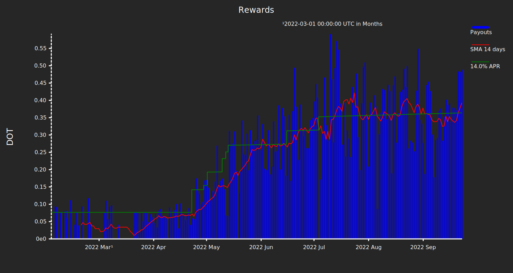

## stake-checker

A command line tool for Polkadot staking reward lookups.

### Configuration

Configure the url of the rpc node, and the polkadot address in an .env file:
```bash
echo "POLKADOT_ADDR=<your_address_here>" >> .env
echo "RPC_ENDPOINT=https://polkadot-rpc.dwellir.com" >> .env
echo "SUBQUERY_ENDPOINT_REWARDS=https://api.subquery.network/sq/subquery/tutorial---staking-sum" >> .env
echo "SUBQUERY_ENDPOINT_STAKE_CHANGES=https://api.subquery.network/sq/nova-wallet/nova-polkadot" >> .env
echo "KNOWN_REWARDS_FILE=known_rewards.csv" >> .env
echo "KNOWN_STAKE_CHANGES_FILE=known_stake_changes.csv" >> .env
echo "POLKADOT_PROPERTIES_FILE=polkadot_properties.json" >> .env
```

### Usage

Build the main binary and ask what it can do for you:
```bash
cargo run --bin stake-checker -- --help
```

Do an example rpc query for total issuance on polkadot
```bash
cargo run --bin stake-checker -- --total_issuance
```

Make the same query but by providing a storage method and a storage name
```bash
cargo run --bin stake-checker -- --get_storage Balances TotalIssuance
```

Ask the subquery rewards endpoint for a list of your latest staking rewards that were not already listed among your known rewards, and append them onto your file of known rewards
```bash
cargo run --bin stake-checker -- --staking_rewards >> known_rewards.csv
```

Ask the subquery stake changes endpoint for an analogous list
```bash
cargo run --bin stake-checker -- --stake_changes >> known_stake_changes.csv
```

Plot known staking rewards in an svg file.
```bash
cargo run --bin plotit > plot.svg
```

I suggest tailoring usage to your needs with a script.
A basic script called `check.sh` is included.
Is uses the program eog to view the generated plot.
I invoke it like this

```bash
./check.sh
```

... and it gives me a plot like this:



### Reading List
 - [Querying Substrate Storage Via rpc](https://www.shawntabrizi.com/substrate/querying-substrate-storage-via-rpc/)
 - [Transparent Keys in Substrate](https://www.shawntabrizi.com/substrate/transparent-keys-in-substrate/)
 - [Polkadot Interaction Examples rs](https://github.com/paritytech/polkadot-interaction-examples-rs)
 - [subxt: A Library to Submit Extrinsics to a Substrate Node via RPC](https://github.com/paritytech/subxt)
 - [substrate-api-client: A Rust Lib for Connecting to Substrate RPC Interface via WebSockets](https://github.com/scs/substrate-api-client)
 - [SubQuery Staking Sum Tutorial Example](https://explorer.subquery.network/subquery/subquery/tutorial---staking-sum)
